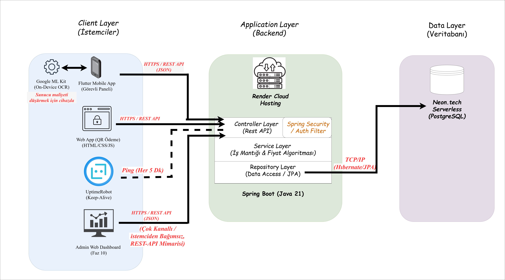

# 🅿️ BilPark - Next-Generation Parking Management System

  -blue)    

> A cloud-based, mobile-first smart parking solution is digitizing urban parking management.

---

## 🎯 Vision

**The Problem:**
Traditional parking systems based on paper tickets and handheld terminals increase operational workload and lead to revenue loss by making vehicle tracking and collection more difficult.

**The Solution:**
**BilPark** replaces physical tickets with **On-Device OCR and QR** technologies.
* **Backend (The Brain):** A robust Java Spring Boot architecture handling concurrent vehicle tracking and complex pricing algorithms, hosted 24/7 on **Render**.
* **Database (The Memory):** Secure, serverless data storage powered by **Neon.tech (PostgreSQL)**.
* **Mobile (The Field):** A modern, device-agnostic Flutter application featuring an intuitive drag-and-drop interface and Dark Mode, enabling field officers to manage operations seamlessly from anywhere.

---

## ⚙️ Key Features

* **24/7 Cloud Availability:** The backend operates continuously on Render, kept active via *UptimeRobot* with UTC+3 timezone synchronization.
* **On-Device OCR:** Instant license plate recognition using Google ML Kit, processing data locally to ensure high performance even with low connectivity. 
* It complies with the European General Data Protection Regulation (GDPR)
* **Smart Grid & Drag-and-Drop:** An intuitive UI to assign vehicles to parking spots. Empty spots are dynamically sorted to the top for faster access.
* **Dynamic Vehicle Classification:** Distinct UI elements and pricing models for standard vs. commercial vehicles.
* **Location-Based Auth:** Field staff securely log in and exclusively manage their assigned zones/neighborhoods.
* **SOLID Architecture:** Clean, maintainable, and scalable codebases utilizing N-Tier architecture on the backend and State Management on the frontend.

---

## 🛠️ Tech Stack

The architectural design focuses on modularity and scalability.

| Layer | Technology | Description |
| :--- | :--- | :--- |
| **Backend** | ☕ **Java 21 & Spring Boot 3** | Enterprise-grade, high-performance REST API. |
| **Database** | 🐘 **PostgreSQL (Neon.tech)** | Serverless Cloud Database infrastructure. |
| **Cloud/DevOps**| ☁️ **Render & UptimeRobot** | Cloud hosting with automated keep-alive mechanisms. |
| **ORM** | 🍃 **Spring Data JPA** | Hibernate-based data access layer. |
| **Mobile** | 💙 **Flutter (Dart)** | Cross-platform mobile app built with SOLID principles. |
| **Tools** | 🛠️ **Google ML Kit, Maven, Lombok** | On-device image processing and clean code utilities. |

---

## 💰 Pricing Engine (Business Logic)

The system automatically calculates parking fees based on municipal tariffs. The current active algorithm:

| Rule | Description |
| :--- | :--- |
| **Grace Period** | First 5 Minutes: **FREE** |
| **Standard Vehicle** | 1st Hour: **25.00 TL**   Subsequent Hours: **+15.00 TL/hr** |
| **Large/Commercial**| 1st Hour: **50.00 TL**   Subsequent Hours: **+30.00 TL/hr** |

> *Note: Time is calculated dynamically; any partial hour beyond the first 60 minutes is rounded up to a full hour.*

---

## ⚙️ Installation & Deployment

Since the backend is deployed in the cloud, you can test the mobile app directly without running a local server.

### Option 1: Live Cloud Testing (Mobile Only)
To test the mobile interface connected to the live production server:
1. Navigate to the `mobile` directory.
2. Run `flutter pub get` to install dependencies.
3. Connect your device/emulator and execute `flutter run`.

### Option 2: Full Development Environment (Local)
To modify the core backend business logic:
1. Clone the repository and open the `backend` folder in IntelliJ IDEA.
2. Right-click `pom.xml` -> "Add as Maven Project".
3. Add your Neon.tech PostgreSQL credentials inside `src/main/resources/application.properties`.
4. Run `BackendApplication.java`.
5. Update the `globalBaseUrl` in the Flutter app to your local machine's IP address.

---

## 🗺️ Roadmap

- [x] Phase 1: Monorepo Setup & Spring Boot Initialization
- [x] Phase 2: Database Design (PostgreSQL Neon Migration)
- [x] Phase 3: Repository Layer & Data Seeding
- [x] Phase 4: Service Layer (Business Logic & Pricing Engine)
- [x] Phase 5: Controller Layer (REST API Exposing)
- [x] Phase 6: Mobile App Development (Flutter, SOLID, UI/UX, Dark Mode)
- [x] Phase 7: Camera OCR Integration & Drag-and-Drop UX
- [x] Phase 8: Cloud Deployment (Render & UptimeRobot Integration)
- [ ] Phase 9: Self-Service QR Code Payment Portal for Citizens ⚡ **(CURRENTLY HERE)**
- [ ] Phase 10: Admin Web Dashboard for Real-Time Analytics

---

Developed by Kadir Kacır

Copyright © 2026 Kadir Kacır. All Rights Reserved.