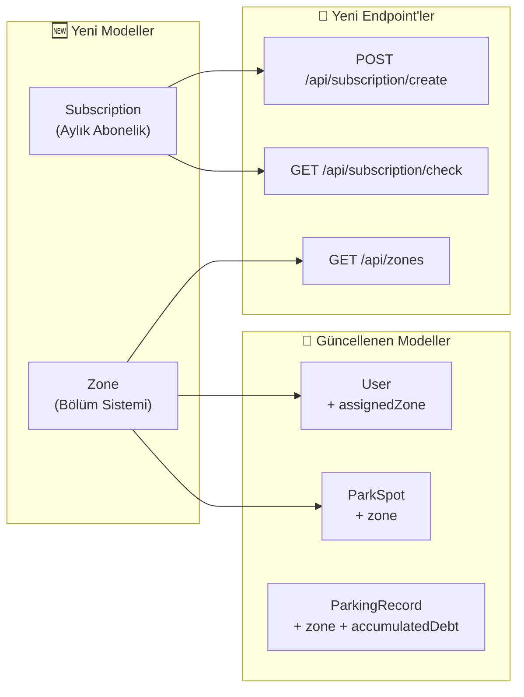

# 🅿️ BilPark — Birleştirilmiş Aksiyon Planı

> **Tarih:** 27 Eylül 2026  
> Önceki analiz + Yeni istekler birleştirildi.

---

## 🏗️ Mimari Değişiklik Özeti



---

## Faz 1 — Backend Veri Modeli Güncellemeleri

### 1.1. `Subscription` Entity (Aylık Abonelik)

Yeni tablo: `subscriptions`

| Alan | Tip | Açıklama |
|------|-----|----------|
| `id` | Long (PK) | Auto-increment |
| `licensePlate` | String (unique) | Abone plakası |
| `vehicleType` | VehicleType | SMALL / LARGE |
| `startDate` | LocalDateTime | Abonelik başlangıcı |
| `endDate` | LocalDateTime | Abonelik bitiş (1 ay sonra) |
| `monthlyFee` | Double | 2500 / 3000 TL |
| `status` | SubscriptionStatus | ACTIVE / EXPIRED / CANCELLED |
| `ownerName` | String | Araç sahibi adı (opsiyonel) |
| `ownerPhone` | String | İletişim (opsiyonel) |

### 1.2. `Zone` Entity (Bölüm/Çalışma Alanı Sistemi)

Yeni tablo: `zones`

| Alan | Tip | Açıklama |
|------|-----|----------|
| `id` | Long (PK) | Auto-increment |
| `street` | StreetLocation | TEVFIK_BEY / ALI_RIZA_OZKAY / CUMHURIYET |
| `zoneNumber` | Integer | 1, 2, 3 (cadde içi bölüm no) |
| `zoneName` | String | "Bölüm 1" (admin tarafından değiştirilebilir) |
| `leftLandmark` | String | Sol kaldırım landmark ("Öncü Döner") |
| `rightLandmark` | String | Sağ kaldırım landmark ("Ziraat Bankası") |

**Bölüm Dağılımı:**
- Tevfik Bey Caddesi → 3 bölüm (3 personel)
- Ali Rıza Özkay Caddesi → 2 bölüm (2 personel)  
- Cumhuriyet Caddesi → 1 bölüm (1 personel)

### 1.3. `User` Modeli Güncelleme

| Değişiklik | Eski | Yeni |
|------------|------|------|
| Bölüm ataması | `assignedStreet` (sadece cadde) | `assignedZone` → `Zone` entity'sine FK |

### 1.4. `ParkSpot` Modeli Güncelleme

| Eklenen Alan | Tip | Açıklama |
|-------------|-----|----------|
| `zone` | Zone (FK) | Aracın hangi bölümde olduğu |

> `side` alanı kalacak (LEFT/RIGHT) ama artık Zone'un `leftLandmark` / `rightLandmark` alanıyla eşleştirilecek.

### 1.5. Cezalı Araç Borç Biriktirme

Mevcut `ParkingRecord` modeline ek:

| Eklenen Alan | Tip | Açıklama |
|-------------|-----|----------|
| `debtPaid` | Boolean | Bu borç ödendi mi? (default: false for RUNAWAY) |

**Mantık:** Check-in sırasında plakaya ait ödenmemiş (`RUNAWAY + debtPaid=false`) kayıtlar sorgulanacak. Varsa toplam borç hesaplanıp personele gösterilecek.

---

## Faz 2 — API & İş Mantığı

### 2.1. Abonelik Endpoint'leri

| Method | Endpoint | İşlev |
|--------|----------|-------|
| `POST` | `/api/subscription/create` | Yeni abonelik oluştur (plaka, tip, ad, telefon) |
| `GET` | `/api/subscription/check?plate=` | Abonelik durumu sorgula |
| `GET` | `/api/subscription/list` | Tüm aktif abonelikleri listele (Admin) |
| `POST` | `/api/subscription/cancel?plate=` | Abonelik iptal (Admin) |

### 2.2. Check-in Akışı Güncellemesi

```
Personel plakayı okuttu
    ↓
1. Abonelik var mı? → Evet → 🟢 "Bu araç ABONEDİR. Bitiş: 15 Ekim 2026" popup'ı + kayıt yapmadan devam
    ↓ Hayır
2. Kaçak borcu var mı? → Evet → 🔴 "DİKKAT: Bu aracın ₺320 ödenmemiş kaçak borcu var!" popup'ı + kayıt yap
    ↓ Hayır  
3. Normal check-in → Kayıt oluştur
```

### 2.3. Bölüm (Zone) Endpoint'leri

| Method | Endpoint | İşlev |
|--------|----------|-------|
| `GET` | `/api/zones` | Tüm bölümleri landmark'larıyla getir |
| `GET` | `/api/zones/by-street?street=` | Cadde bazlı bölümler |
| `PUT` | `/api/zones/{id}/landmarks` | Landmark isimlerini güncelle (Admin) |

### 2.4. Çoklu Kullanıcı Dayanıklılığı

| Çözüm | Detay |
|-------|-------|
| **Optimistic Locking** | `ParkSpot` entity'sine `@Version` alanı eklenir → aynı aracı 2 kişi aynı anda silmeye çalışırsa biri hata alır |
| **Unique Constraint** | `currentPlate` zaten unique → çift kayıt DB seviyesinde engellenir |
| **`@Transactional`** | Tüm write operasyonları atomik → yarım kalan işlem olmaz |
| **Connection Pooling** | HikariCP (Spring Boot default) → 10+ eşzamanlı bağlantı destekler |

### 2.5. Excel Çıktısı Düzeltme

**Sorun:** Admin panelden Excel indirince dosya boş geliyor.  
**Kök neden analizi yapılacak:** `globalHistoryData` dolmadan `downloadExcel()` çağrılıyor olabilir veya CORS/Auth engeliyor.

### 2.6. Borç Devam Sistemi (Kaçak Ceza)

Zaten `markAsRunaway()` metodunda `baseDebt * 2.0` ceza çarpanı var ✅. Ek olarak:
- Check-in'de plakaya ait tüm `RUNAWAY` kayıtlarının borçları toplanacak
- Yeni check-in'de bu bilgi response'a eklenecek

---

## Faz 3 — Mobil Uygulama (Flutter)

### 3.1. Abonelik Popup Bildirimi

Check-in sırasında `/api/subscription/check` sorgulanacak:
- **Abone ise:** Üstten aşağı kayan yeşil popup → "🟢 ABONELİK AKTİF — Bitiş: 15.10.2026"
- **Değilse:** Normal check-in akışı

### 3.2. Bölüm Seçimi (Login Screen Güncelleme)

Mevcut akış: Cadde seçimi → Dashboard  
Yeni akış: Cadde seçimi → **Bölüm seçimi** (API'den gelen zone listesi) → Dashboard

### 3.3. Landmark İsimleri (Çalışma Sahası Ekranı)

Mevcut: `"Sol Kaldırım"` / `"Sağ Kaldırım"`  
Yeni: `"◀ Öncü Döner tarafı"` / `"Ziraat Bankası tarafı ▶"` (Zone'un landmark'larından)

### 3.4. Kaçak Borç Uyarısı

Check-in sırasında kaçak borcu olan araç tespit edilirse:
- 🔴 Kırmızı popup → "DİKKAT: Bu aracın ₺320 ödenmemiş borcu var!"
- Görevli yine de kayıt yapabilir (borç bilgisi kayda eklenir)

### 3.5. Flutter'dan React'a Geçiş Gerekli mi?

**HAYIR.** Flutter zaten hem Android hem iOS'u native derler. Ekstra bir iş yok — mevcut Flutter kodu olduğu gibi iki platformda da çalışır. React Native'a geçiş gereksiz maliyet ve risk.

---

## Faz 4 — Web Frontend

### 4.1. Abonelik Sekmesi (customer-payment.html)

Mevcut ödeme portalına "Aylık Abonelik" sekmesi eklenmesi:
- Plaka, araç tipi, ad, telefon formu
- Fiyat gösterimi (2500/3000 TL)
- Oluşturma butonu

### 4.2. Admin Panel — Ciro KPI Kartları

Mevcut endpoint'lerden veri çekerek 4 yeni KPI kartı:
- 📅 Günlük Ciro (`/income/daily`)
- 📊 Haftalık Ciro (`/income/weekly`)  
- 📈 Aylık Ciro (`/income/monthly`)
- 📉 Yıllık Ciro (`/income/yearly`)

### 4.3. Web `config.js`

2 HTML dosyasındaki hardcoded `BASE_URL`'i tek `config.js` dosyasına taşıma.

### 4.4. Excel Export Fix

Admin paneldeki boş Excel sorununu debug ve düzeltme.

---

## Faz 5 — Repo Kalitesi & GitHub

| Madde | Durum |
|-------|-------|
| LICENSE (MIT) | ❌ → Oluşturulacak |
| CONTRIBUTING.md | ❌ → Oluşturulacak |
| GitHub Actions CI/CD | ❌ → Maven build + test pipeline |
| `withOpacity()` → `withValues()` | ❌ → 3 yerdeki deprecated kullanım düzeltilecek |

---

## ⚡ Uygulama Sırası

| Sıra | Görev | Tahmini |
|------|-------|---------|
| **1** | Zone entity + DB modeli + seed data | Backend temeli |
| **2** | Subscription entity + repository + service | Abonelik altyapısı |
| **3** | User modeli güncelle (zone ataması) | Bölüm bazlı personel |
| **4** | ParkSpot modeli güncelle (zone FK) | Araç-bölüm ilişkisi |
| **5** | Check-in akışı güncelle (abonelik + borç kontrol) | İş mantığı |
| **6** | Yeni endpoint'ler (subscription, zone) | API katmanı |
| **7** | Mobile — bölüm seçimi + landmark isimleri | Flutter UX |
| **8** | Mobile — abonelik/borç popup bildirimleri | Flutter UX |
| **9** | Web — abonelik sekmesi + KPI kartları + Excel fix | Web frontend |
| **10** | Repo dosyaları (LICENSE, CONTRIBUTING, CI) | GitHub kalitesi |

> [!IMPORTANT]
> Plan onaylandığında adım adım uygulamaya başlıyoruz. Her adımda çalışan, test edilebilir kod üretilecek.
