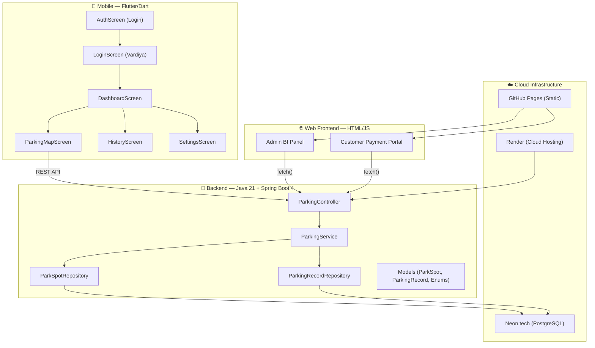

# 🅿️ BilPark - Kapsamlı Proje Analiz Raporu

## 📐 1. Proje Mimarisi



---

## 🗂️ 2. Dosya Yapısı Haritası

| Katman | Dosya | Boyut | Açıklama |
|--------|-------|-------|----------|
| **Backend** | [`BackendApplication.java`](file:///c:/Users/LENOVO/Documents/bilpark-parking-system/backend/src/main/java/com/bilpark/backend/BackendApplication.java) | 621B | Spring Boot giriş noktası, TR timezone |
| **Model** | [`ParkSpot.java`](file:///c:/Users/LENOVO/Documents/bilpark-parking-system/backend/src/main/java/com/bilpark/backend/model/ParkSpot.java) | 4.3KB | Aktif park yeri entity'si |
| **Model** | [`ParkingRecord.java`](file:///c:/Users/LENOVO/Documents/bilpark-parking-system/backend/src/main/java/com/bilpark/backend/model/ParkingRecord.java) | 3.5KB | Arşiv/Fiş entity'si |
| **Model** | [`ParkingStatus.java`](file:///c:/Users/LENOVO/Documents/bilpark-parking-system/backend/src/main/java/com/bilpark/backend/model/ParkingStatus.java) | 234B | ACTIVE / PAID / RUNAWAY |
| **Model** | [`StreetLocation.java`](file:///c:/Users/LENOVO/Documents/bilpark-parking-system/backend/src/main/java/com/bilpark/backend/model/StreetLocation.java) | 422B | 3 cadde enum'u |
| **Model** | [`VehicleType.java`](file:///c:/Users/LENOVO/Documents/bilpark-parking-system/backend/src/main/java/com/bilpark/backend/model/VehicleType.java) | 510B | SMALL / LARGE |
| **Repository** | [`ParkSpotRepository.java`](file:///c:/Users/LENOVO/Documents/bilpark-parking-system/backend/src/main/java/com/bilpark/backend/repository/ParkSpotRepository.java) | 2.0KB | Aktif araç sorguları |
| **Repository** | [`ParkingRecordRepository.java`](file:///c:/Users/LENOVO/Documents/bilpark-parking-system/backend/src/main/java/com/bilpark/backend/repository/ParkingRecordRepository.java) | 3.0KB | Arşiv sorguları, JPQL |
| **Service** | [`ParkingService.java`](file:///c:/Users/LENOVO/Documents/bilpark-parking-system/backend/src/main/java/com/bilpark/backend/service/ParkingService.java) | 14KB | Tüm iş mantığı (300 satır) |
| **Controller** | [`ParkingController.java`](file:///c:/Users/LENOVO/Documents/bilpark-parking-system/backend/src/main/java/com/bilpark/backend/controller/ParkingController.java) | 9.4KB | 15 REST endpoint |
| **Config** | [`DataInitializer.java`](file:///c:/Users/LENOVO/Documents/bilpark-parking-system/backend/src/main/java/com/bilpark/backend/config/DataInitializer.java) | 672B | Boş config sınıfı |
| **Config** | [`Dockerfile`](file:///c:/Users/LENOVO/Documents/bilpark-parking-system/backend/Dockerfile) | 2.6KB | Multi-stage Docker build |
| **Web** | [`admin-panel.html`](file:///c:/Users/LENOVO/Documents/bilpark-parking-system/web/admin-panel.html) | 17KB | BI Dashboard (Chart.js + SheetJS) |
| **Web** | [`customer-payment.html`](file:///c:/Users/LENOVO/Documents/bilpark-parking-system/web/customer-payment.html) | 12KB | Vatandaş ödeme portalı |
| **Mobile** | [`main.dart`](file:///c:/Users/LENOVO/Documents/bilpark-parking-system/mobile/lib/main.dart) | 3.3KB | Tema yönetimi, routing |
| **Mobile** | [`auth_screen.dart`](file:///c:/Users/LENOVO/Documents/bilpark-parking-system/mobile/lib/screens/auth_screen.dart) | 5.5KB | Personel giriş ekranı |
| **Mobile** | [`login_screen.dart`](file:///c:/Users/LENOVO/Documents/bilpark-parking-system/mobile/lib/screens/login_screen.dart) | 5.6KB | Vardiya/Lokasyon seçimi |
| **Mobile** | [`dashboard_screen.dart`](file:///c:/Users/LENOVO/Documents/bilpark-parking-system/mobile/lib/screens/dashboard_screen.dart) | 6.3KB | Ana panel + navigasyon |
| **Mobile** | [`parking_map_screen.dart`](file:///c:/Users/LENOVO/Documents/bilpark-parking-system/mobile/lib/screens/parking_map_screen.dart) | 21KB | Saha görünümü + OCR + QR |
| **Mobile** | [`history_screen.dart`](file:///c:/Users/LENOVO/Documents/bilpark-parking-system/mobile/lib/screens/history_screen.dart) | 10KB | Geçmiş + Kaçak filtresi |
| **Mobile** | [`settings_screen.dart`](file:///c:/Users/LENOVO/Documents/bilpark-parking-system/mobile/lib/screens/settings_screen.dart) | 3.5KB | Dark mode + çıkış |

---

## 🔌 3. REST API Endpoint Haritası

| # | Method | Endpoint | İşlev |
|---|--------|----------|-------|
| 1 | `GET` | `/api/parking/spots` | Tüm aktif araçları listele |
| 2 | `POST` | `/api/parking/check-in` | Araç girişi (plaka, cadde, tip, yön) |
| 3 | `POST` | `/api/parking/check-out` | Normal çıkış + ücret hesabı |
| 4 | `POST` | `/api/parking/runaway` | Kaçak araç bildirimi |
| 5 | `GET` | `/api/parking/income` | Toplam ciro |
| 6 | `GET` | `/api/parking/income/daily` | Günlük ciro |
| 7 | `GET` | `/api/parking/income/weekly` | Haftalık ciro |
| 8 | `GET` | `/api/parking/income/monthly` | Aylık ciro |
| 9 | `GET` | `/api/parking/income/yearly` | Yıllık ciro |
| 10 | `GET` | `/api/parking/filter` | Cadde bazlı filtre |
| 11 | `GET` | `/api/parking/history` | Cadde geçmişi (son 50) |
| 12 | `GET` | `/api/parking/history/search` | Plaka ile geçmiş arama |
| 13 | `GET` | `/api/parking/debt` | Borç sorgulama |
| 14 | `POST` | `/api/parking/pay` | Vatandaş ödeme + otomatik çıkış |
| 15 | `GET` | `/api/parking/bi/income-by-type` | Araç tipine göre ciro dağılımı |
| 16 | `GET` | `/api/parking/bi/status-count` | Ödenen/Kaçan sayıları |
| 17 | `GET` | `/api/parking/bi/last-records` | Son 100 arşiv kaydı |

---

## ✅ 4. Projenin Güçlü Yanları

| # | Güçlü Yan | Detay |
|---|-----------|-------|
| 1 | **Full-Stack Monorepo** | Backend + Mobile + Web tek repoda, staj için ideal |
| 2 | **N-Tier Mimari** | Controller → Service → Repository katmanlı yapı doğru |
| 3 | **Gerçek Cloud Deployment** | Render + Neon.tech gerçek dünya deneyimi |
| 4 | **Docker Multi-Stage Build** | Alpine JRE ile optimize edilmiş production image |
| 5 | **Dynamic Capacity** | Sabit kutu değil, araç geldikçe büyüyen sokak modeli |
| 6 | **On-Device OCR** | Google ML Kit ile cihaz üzeri plaka tanıma (GDPR uyumlu) |
| 7 | **QR Self-Checkout** | Dinamik QR kod üretimi + vatandaş ödeme portalı |
| 8 | **BI Dashboard** | Chart.js grafikleri + Excel export |
| 9 | **Dark Mode** | ValueNotifier ile global tema değiştirme |
| 10 | **İş Mantığı Zenginliği** | Tarife motoru, kaçak takip, çoklu ciro analizi |

---

## 🔴 5. Tespit Edilen Sorunlar & İyileştirme Alanları

### 5.1. Backend Sorunları

| # | Sorun | Önem | Dosya/Satır |
|---|-------|------|-------------|
| 1 | **Güvenlik Yok** — Spring Security veya JWT yok, `@CrossOrigin("*")` tüm dünyaya açık | 🔴 Kritik | [`ParkingController.java:22`](file:///c:/Users/LENOVO/Documents/bilpark-parking-system/backend/src/main/java/com/bilpark/backend/controller/ParkingController.java#L22) |
| 2 | **Lombok kullanılmıyor** — `pom.xml`'de Lombok var ama tüm getter/setter'lar elle yazılmış | 🟡 Orta | Tüm model sınıfları |
| 3 | **DTO/Response pattern yok** — Entity'ler direkt JSON'a dönüyor, API sözleşmesi kırılgan | 🟡 Orta | Controller |
| 4 | **Exception Handler yok** — Her endpoint'te try-catch tekrarı, `@ControllerAdvice` eksik | 🟡 Orta | Controller |
| 5 | **`calculateIncomeByVehicleType()` N+1 riski** — Tüm kayıtları çekip Java'da filtreleme | 🟡 Orta | [`ParkingService.java:264`](file:///c:/Users/LENOVO/Documents/bilpark-parking-system/backend/src/main/java/com/bilpark/backend/service/ParkingService.java#L264) |
| 6 | **Test sınıfları boş** — Hiç unit/integration test yazılmamış | 🟡 Orta | `src/test/` |
| 7 | **Validation eksik** — `@Valid` annotation kullanılmıyor, plaka format kontrolü backend'de yok | 🟡 Orta | Controller |
| 8 | **`application.properties` gizli bilgi** — DB credential'ları .gitignore'da değil | 🔴 Kritik | resources/ |
| 9 | **Swagger/OpenAPI yok** — API dokümantasyonu mevcut değil | 🟡 Orta | — |
| 10 | **Endpoint path tutarsızlıkları** — Bazılarında `/` başlangıcı var, bazılarında yok | 🟢 Düşük | Controller |

### 5.2. Mobile (Flutter) Sorunları

| # | Sorun | Önem |
|---|-------|------|
| 1 | **`globalBaseUrl` her dosyada tekrar tanımlı** — 3 farklı dosyada aynı URL | 🟡 Orta |
| 2 | **State Management yok** — Provider/Riverpod/BLoC kullanılmıyor, her ekran kendi state'ini yönetiyor | 🟡 Orta |
| 3 | **Sabit kodlanmış renkler** — `Color(0xFF3F51B5)` her yerde tekrar ediyor, tema sistemi tam kullanılmıyor | 🟢 Düşük |
| 4 | **`_backendStreetEnum` getter'ı 3 dosyada copy-paste** — DRY ihlali | 🟡 Orta |
| 5 | **Auth ekranı bypass edilebilir** — Şifre kontrolü yapılmıyor (prototip durumunda) | 🔴 Kritik |
| 6 | **Error handling zayıf** — API hataları kullanıcıya anlamlı gösterilmiyor | 🟡 Orta |
| 7 | **`withOpacity()` deprecated uyarısı** — Flutter 3.10+ için `.withValues()` kullanılmalı | 🟢 Düşük |

### 5.3. Web Frontend Sorunları

| # | Sorun | Önem |
|---|-------|------|
| 1 | **İki HTML dosyasında `BASE_URL` hardcoded** — Ortam değişikliğinde 2 yeri güncelleme gerek | 🟡 Orta |
| 2 | **Admin panelde Ciro KPI'ları eksik** — Günlük/haftalık/aylık ciro kartları yok (endpoint var) | 🟡 Orta |
| 3 | **Vardiya tablosu statik** — Personel bilgileri hardcoded, backend'den gelmiyor | 🟡 Orta |
| 4 | **Responsive test eksik** — Admin panel mobilde tam optimize değil | 🟢 Düşük |

---

## 🚀 6. Eklenebilecek Yeni Özellikler (Öneri Listesi)

### 🔐 Tier 1 — Güvenlik & Temel (Staj İçin Kritik)
| # | Özellik | Zorluk | Etki |
|---|---------|--------|------|
| 1 | **Spring Security + JWT Authentication** | ⭐⭐⭐ | Backend'e gerçek auth eklemek (User tablosu + login endpoint) |
| 2 | **Role-Based Access Control (RBAC)** | ⭐⭐⭐ | ADMIN / OFFICER rolleri, endpoint bazlı yetkilendirme |
| 3 | **Global Exception Handler (`@ControllerAdvice`)** | ⭐⭐ | Tutarlı hata yönetimi, clean error responses |
| 4 | **DTO Pattern (Request/Response)** | ⭐⭐ | Entity'leri API'den izole etmek |
| 5 | **Input Validation (`@Valid` + custom validators)** | ⭐⭐ | Plaka format kontrolü, XSS koruması |

### 📊 Tier 2 — Profesyonel Özellikler
| # | Özellik | Zorluk | Etki |
|---|---------|--------|------|
| 6 | **Swagger/OpenAPI Dokümantasyonu** | ⭐ | Otomatik API docs, staj mülakatında çok iyi görünür |
| 7 | **Unit + Integration Tests** | ⭐⭐ | JUnit 5 + Mockito ile service testleri |
| 8 | **Admin Panele Ciro KPI Kartları** | ⭐ | Günlük/Haftalık/Aylık/Yıllık ciro dashboard'da görünsün |
| 9 | **Push Notification (Kaçak Araç Uyarısı)** | ⭐⭐⭐ | Firebase FCM ile saha görevlisine anlık bildirim |
| 10 | **Ceza Çarpanı Sistemi** | ⭐ | Kaçak araçların borçlarına %50 ceza eklenmesi |

### 🎨 Tier 3 — UX & Arayüz Güncellemeleri
| # | Özellik | Zorluk | Etki |
|---|---------|--------|------|
| 11 | **Admin Paneli React/Next.js'e Taşıma** | ⭐⭐⭐ | Modern SPA, component bazlı, routing |
| 12 | **Mobile'da Provider/Riverpod State Management** | ⭐⭐ | Clean architecture, testable code |
| 13 | **Heatmap Görünümü** | ⭐⭐ | Hangi cadde ne kadar dolu görseli |
| 14 | **Araç Fotoğraf Kaydı** | ⭐⭐ | OCR ile birlikte fotoğrafı da sunucuya kaydetme |
| 15 | **Çoklu Dil Desteği (i18n)** | ⭐⭐ | TR/EN, staj başvurularında uluslararası profil |

---

## 📝 7. Kod Düzenleme Öncelikleri (Quick Wins)

> [!IMPORTANT]
> Aşağıdakiler hızlıca yapılabilecek ve projeyi anında daha profesyonel gösterecek düzenlemelerdir:

1. **Lombok `@Data` / `@Getter` / `@Setter` aktifleştir** — Model sınıflarından ~150 satır boilerplate silinir
2. **`globalBaseUrl`'i tek bir config dosyasına taşı** — Flutter'da `constants.dart`, Web'de `config.js`
3. **`_backendStreetEnum` helper'ını ortak utility'ye taşı** — 3 farklı dosyadaki tekrarı kaldır
4. **`@ControllerAdvice` + `GlobalExceptionHandler` yaz** — Controller'daki tüm try-catch'ler temizlenir
5. **`application.properties`'i environment variable'a çevir** — `${DB_URL}` formatında
6. **Controller endpoint yollarında `/` tutarlılığını sağla** — `"income/monthly"` → `"/income/monthly"`
7. **Yorum dilini İngilizce'ye çevir** — GitHub'da uluslararası görünürlük
8. **`.gitignore`'a `application.properties` ekle** — DB şifresi public olmasın

---

## 🎯 8. GitHub Staj Başvurusu İçin Repo Planı

### Yapılacaklar Checklist:
- [ ] **README.md yeniden yazılsın** — İngilizce, profesyonel badge'ler, GIF demo'lar, mimari diyagram
- [ ] **CONTRIBUTING.md** eklensin
- [ ] **LICENSE** dosyası (MIT) eklensin
- [ ] **`.env.example`** dosyası eklensin (credential'lar gizli kalacak)
- [ ] **API Documentation** (Swagger veya markdown) eklensin
- [ ] **Proje ekran görüntüleri** optimize edilsin ve README'ye entegre edilsin
- [ ] **GitHub Actions CI/CD** pipeline eklensin (build + test)
- [ ] **Issue Templates** ve **PR Templates** eklensin
- [ ] **Commit geçmişi** temizlensin (conventional commits)
- [ ] **Branch stratejisi** (`main`, `develop`, `feature/*`)

### Önerilen README Yapısı:
```
1. Hero Banner + Badges
2. 🎯 Problem & Solution (1 paragraf)
3. ✨ Key Features (bullet list)
4. 🏗️ Architecture Diagram
5. 🛠️ Tech Stack (tablo)
6. 📸 Screenshots / GIF Demo
7. 🔌 API Documentation
8. ⚙️ Installation (Local + Cloud)
9. 🧪 Testing
10. 🗺️ Roadmap
11. 👥 Contributing
12. 📄 License
```
